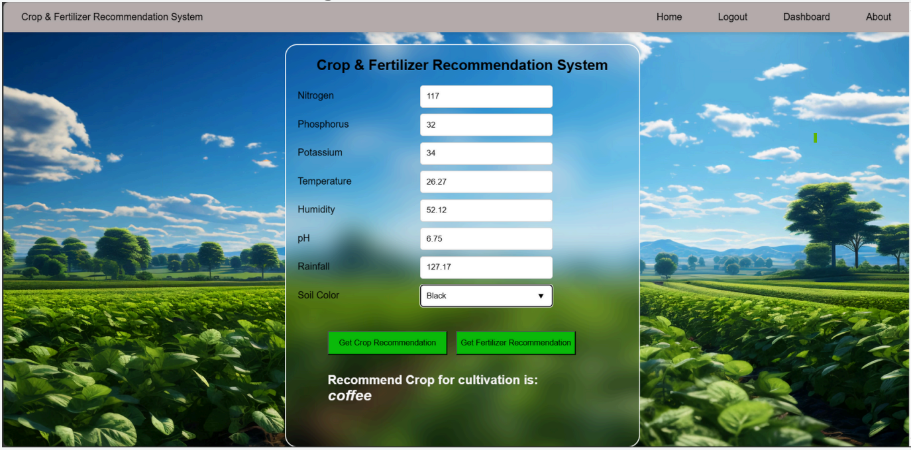
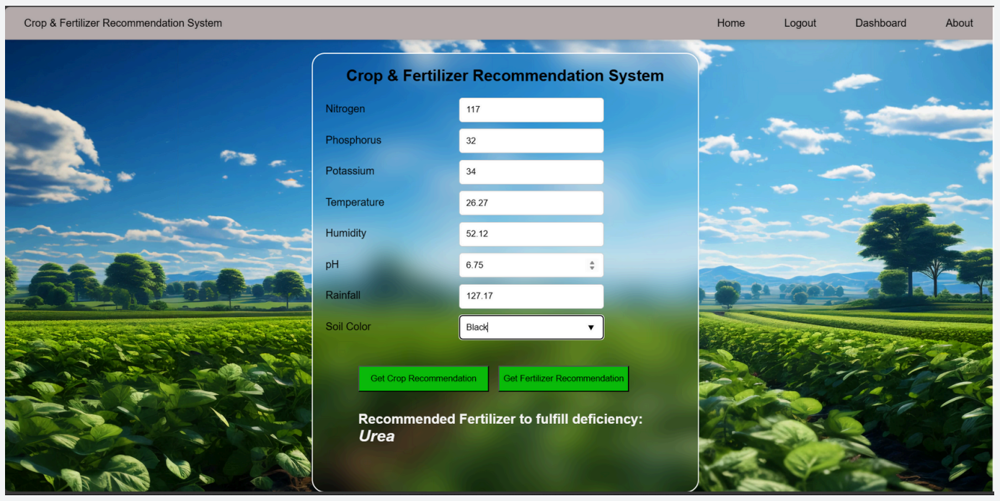

# Crop & Fertilizer Recommendation System

A web application that leverages machine learning to provide personalized recommendations for optimal crop selection and fertilizer use based on soil and nutrient data. This tool is designed to support farmers and agricultural experts in maximizing yield and improving sustainability.

## Features

- **Crop Recommendation:** Suggests the most suitable crops for your farmland by analyzing soil nutrient composition.
- **Fertilizer Recommendation:** Recommends effective fertilizers tailored to your soil’s nutrient levels.
- **User Dashboard:** View prediction history and manage your recommendations.

## Demo




*Add more screenshots or a link to a live demo here if available.*

## Getting Started

### Prerequisites

- Python 3.x installed
- MySQL database (for user and prediction data)
- (Recommended) Virtual environment tool such as `venv`

### Installation

1. **Clone the repository:**
    ```bash
    git clone https://github.com/BirendraKSharma/minor_project.git
    cd minor_project
    ```

2. **Create and activate a virtual environment:**
    ```bash
    python -m venv myenv
    # On Windows:
    myenv\Scripts\activate
    # On Unix or MacOS:
    source myenv/bin/activate
    ```

3. **Install dependencies:**
    ```bash
    pip install -r requirements.txt
    ```

4. **Configure your database:**
    - Set up your MySQL instance and update the database connection details in the project’s configuration file (if applicable).

5. **Run the application:**
    ```bash
    python app.py
    ```
    The application will be available at `http://127.0.0.1:5000/` by default.

## Usage

1. Open your browser and go to `http://127.0.0.1:5000/`.
2. Use the provided forms to input soil nutrient values.
3. Receive recommendations for crops and fertilizers.
4. Use the dashboard to browse your previous predictions.

## Project Structure

- `app.py`: Main Flask application.
- `templates/`: HTML templates for the web interface.
- `requirements.txt`: Python dependencies.
- `myenv/`: Virtual environment directory (not included in version control).

## Dependencies

Major libraries used (see `requirements.txt` for full list):
- Flask
- Flask-Bcrypt
- numpy
- pandas
- mysqlclient
- Jinja2

## Contributing

Contributions are welcome! Please open an issue or submit a pull request.

## License

*Specify your license here, e.g., MIT. Add a LICENSE file if you haven’t yet.*

## Contact

For questions or feedback, open an issue on this repository or contact the maintainer: [BirendraKSharma](https://github.com/BirendraKSharma)
